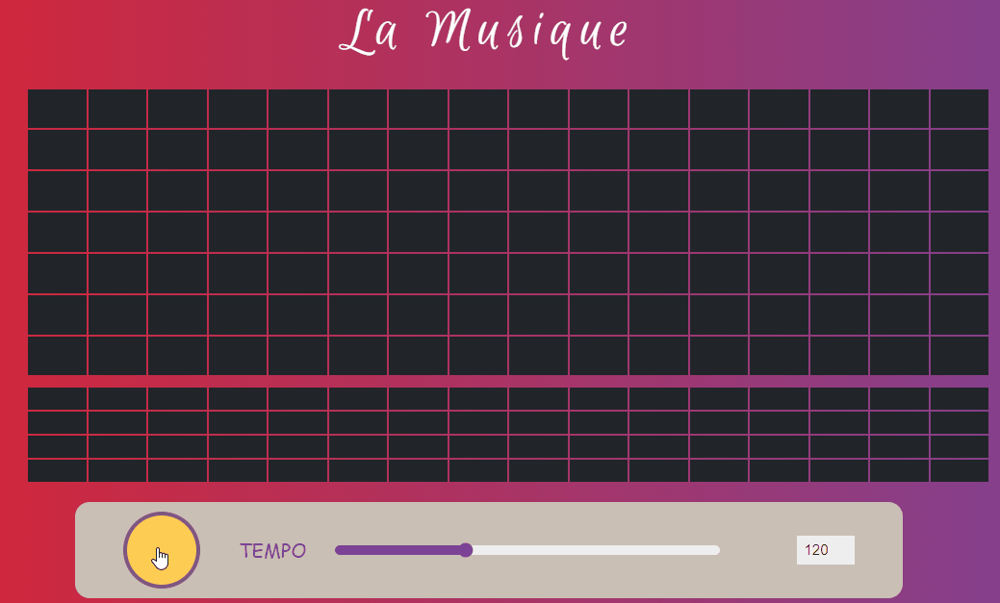

<h1 align="center">La Musique</h1>

 A fun and intuitive way to create rhythms and melodies. 

## Demo

[La Musique](https://akashmeshram.github.io/La-Musique/) is free and open-source music sequencer, designed to be used online.

## About
La Musique is an attempt to make music sequencer a tool that feels easy to use especially for non-musicians.

## Author
👤 [Akash Meshram](https://github.com/akashmeshram) - idea and initial work

## License
Copyright © 2019 [Akash Meshram](https://github.com/akashmeshram). 
This project is licensed under the MIT License - see the [LICENSE](./LICENSE) file for details
